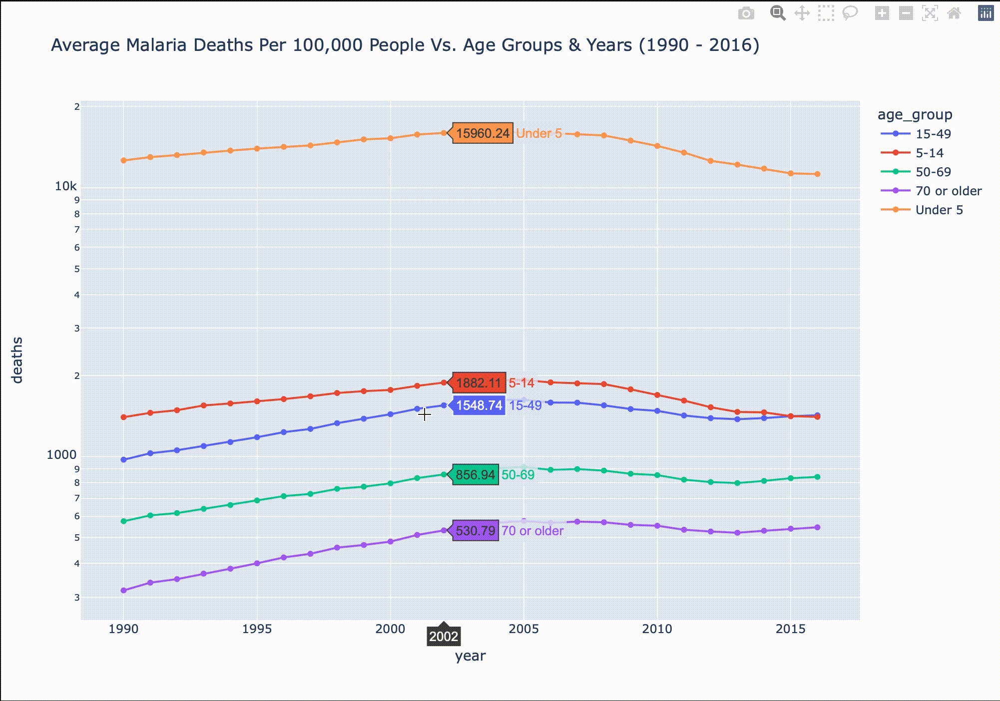

# Malaria Interactive Visualization

According to [CDC](https://www.cdc.gov/parasites/malaria/index.html), Malaria is a mosquito-borne disease that had approximatel 229 million cases worldwide in 2019, and resulted in 409,000 deaths. This repository contains a 3 interactive visualiztions that aim to demonstrate the global impac of Malaria.

The data used for my visualization is from the [TidyTuesday](https://github.com/rfordatascience/tidytuesday) open source project, and contains the following 3 datasets: 
- `malaria_deaths.csv` — Malaria deaths by country for all ages across the world and time
- `malaria_deaths_age.csv` — Malaria deaths by age across the world and time
- `malaria _inc.csv` — Malaria incidence by country for all ages across the world and time

For visualization, I'm using `Plotly` for its flexibility in creating a wide range of scientific graphs and charts. It also allows for interactivity with the created plots, as show below:
- hover over to get detailed information on death and incidence rates
- use the slider to change time

## Blog Post

In addition, I have a Medium blog post that describe these visualizations. 

Topic | Post
-------|-----
Malaria Interactive Visualization | [Interactive Visualization on Malaria Data](https://michaeltang101.medium.com/interactive-visualization-on-malaria-data-6570ff59cbae)
